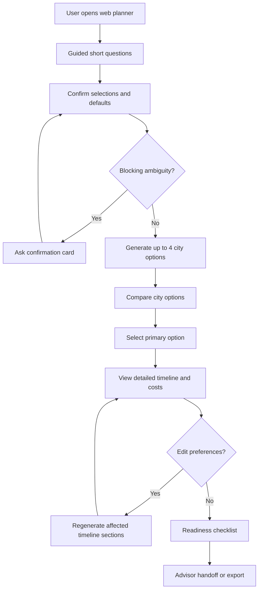

# MedTour AI Web Platform Design Specification

Version: v1.0  
Date: 2026-06-29  
Source: `PRD.md`  
Product type: Responsive web platform and mobile web experience  
Primary users: Overseas users planning medical travel to China, medical advisors, operations administrators  

## 1. Design Goals

MedTour AI should feel like a calm, precise planning workspace for a high-stakes trip. The design must help users compare medical travel options without feeling trapped in a long form, then confidently choose one city plan and refine it.

Primary design goals:

- Make the first input as simple as possible.
- Generate multiple city options before asking the user to commit.
- Show each option as a complete plan with timeline, cost estimate, risks, and readiness tasks.
- Let users understand uncertainty instead of hiding it.
- Let users edit preferences and regenerate timelines without losing previous options.
- Make the experience usable on desktop and mobile web.
- Avoid looking like a generic travel landing page or a hospital portal.

## 2. Product Experience Principles

### 2.1 Low-Friction First Step

The first screen should ask for the minimum viable planning intent:

- Medical need
- Nationality or residence country
- Departure city
- Rough travel date
- Acceptable trip duration
- Season flexibility, including whether winter or off-season travel is acceptable

The first screen should not use an open free-text box as the primary input. It should use adaptive short questions, selection cards, chips, search-select controls, and date controls. Each answer determines the next question, so users only see relevant choices.

### 2.2 Compare Before Commit

The generated report should not immediately push one destination. It should show up to four China city options, each with enough detail to compare:

- City and recommendation label
- Hospital or institution
- Timeline length
- Medical cost
- Travel cost
- Total estimated cost
- Estimated savings
- Flight and hotel convenience
- Risk and uncertainty

### 2.3 Explain Uncertainty

When an agent is unsure or several choices are reasonable, the UI should ask the user to confirm with short decision cards. The user should see why the question matters and how each option changes the plan.

### 2.4 Medical Constraints Are Visible

Medical nodes, such as pre-op checks, surgery, treatment, and follow-up reviews, must be visually locked inside the timeline. Travel and tourism can move around them, but medical constraints should not look casually draggable.

### 2.5 Every Number Needs Context

Costs should always show:

- Currency
- Estimate range or exact value
- Included components
- Data freshness
- Confidence level
- Whether the value is real-time, estimated, or advisor-confirmed

## 3. Information Architecture

### 3.1 Public User Platform

Primary navigation:

- Plan
- Compare
- Timeline
- Costs
- Readiness
- Advisor

Secondary utilities:

- Language selector
- Currency selector
- Save
- Export PDF
- Share
- Account

### 3.2 Advisor Workspace

Primary navigation:

- Leads
- Reports
- User profile
- Advisor notes
- Appointment status
- Contact history

### 3.3 Operations Workspace

Primary navigation:

- Hospital knowledge base
- Medical project rules
- City rules
- Price data
- Visa and payment links
- Content freshness
- Audit logs

## 4. Core User Flow

### 4.1 First-Time Planner Flow

1. User lands on the web app.
2. The first viewport is the planning input, not a marketing landing page.
3. User answers a short medical-purpose question:
   - Eye surgery
   - Dental care
   - Health checkup
   - Medical aesthetics
   - Other common procedures
4. The next question depends on the previous answer. For example, Eye surgery asks:
   - SMILE Pro
   - LASIK
   - ICL
   - Not sure yet
5. User selects nationality or residence country.
6. User selects departure city with search-select.
7. User selects planning date:
   - Specific date
   - Month
   - Date range
   - Flexible
8. User selects acceptable trip duration:
   - 3-4 days
   - 5-7 days
   - 8+ days
   - Not sure
9. User answers season flexibility:
   - Winter is acceptable
   - Off-season is acceptable
   - Only my selected month
   - Depends on price
10. The UI shows a compact confirmation panel with selected fields and system defaults.
11. Defaults are visible:
   - Budget: balanced
   - Traveler count: 1
   - Hotel: near hospital, foreigner-friendly
   - Tourism intensity: light
12. User clicks Generate Options.
13. The generation page shows agent progress and the exact stages being worked on.
14. The result page opens with a multi-city comparison overview.

### 4.2 Multi-City Option Flow

1. The system generates up to four city options.
2. Each option appears as a dense comparison card.
3. Cards use labels such as:
   - Best Overall
   - Lowest Total Cost
   - Shortest Trip
   - Strongest Medical Resources
   - Easiest Flights
4. Each card includes:
   - City
   - Hospital or institution
   - Required days
   - Total estimated cost
   - Estimated savings
   - Medical confidence
   - Travel confidence
   - Key risk count
   - Primary CTA: Select Plan
   - Secondary CTA: View Details
5. User can open Compare View to see all options side by side.
6. User selects one option as primary.
7. The selected plan becomes editable and enters detailed planning mode.
8. Other city options remain available as alternatives.

### 4.3 Agent Clarification Flow

Agents should ask questions only when the answer changes a meaningful outcome.

Trigger examples:

- Medical project is ambiguous.
- Two cities are close in ranking.
- Visa status is uncertain.
- Hotel foreign-guest eligibility is unknown.
- Flight time conflicts with a medical appointment.
- Budget and desired service level do not match.

Interaction pattern:

1. A confirmation card appears in context.
2. The card title states the decision.
3. A short reason explains why it matters.
4. Up to three options are shown.
5. One option is marked Recommended.
6. Each option includes a concise impact summary.
7. User selects an option.
8. Only affected plan sections regenerate.

Example confirmation card:

```text
Choose planning priority
Why this matters: Shanghai and Guangzhou both work, but costs and trip length differ.

[Recommended] Best overall
Balanced medical strength, flight convenience, and total cost.

[Lowest cost]
May use a less central hotel and one extra transfer.

[Fastest trip]
Higher flight and hotel cost, shorter stay.
```

### 4.4 Timeline Editing Flow

1. User opens the selected city plan.
2. The timeline page shows medical hard constraints locked.
3. User clicks Edit Timeline.
4. A side panel opens with editable preferences:
   - Date range
   - Stay length
   - Flight preference
   - Hotel tier
   - Hotel distance
   - Tourism intensity
   - Daily start and end time
   - Need airport pickup
   - Need interpreter or companion
   - Budget ceiling
5. User changes preferences.
6. The system previews affected sections.
7. User clicks Regenerate Timeline.
8. Timeline Generator recalculates only the affected nodes.
9. The UI shows a diff summary:
   - Cost changed by
   - Total days changed by
   - Hotel changed from/to
   - Flight changed from/to
   - Risk level changed
10. User accepts the new version, keeps the old one, or edits again.

### 4.5 Readiness Flow

The readiness page should turn visa, payment, medical documents, and trip preparation into a checklist.

Readiness categories:

- Visa and entry
- Alipay and payment
- Medical documents
- Connectivity
- Insurance
- Emergency contacts
- Luggage and recovery items

Each readiness item includes:

- Status
- Priority
- Deadline
- Why it matters
- Official link or source
- Advisor confirmation status

High-risk incomplete items should appear in the report header and timeline.

### 4.6 Advisor Handoff Flow

1. User clicks Contact Advisor.
2. A consent dialog explains what data will be shared.
3. User chooses preferred language and contact method.
4. User submits contact details.
5. Advisor receives:
   - User profile
   - Selected city plan
   - Alternative city options
   - Timeline
   - Cost breakdown
   - Readiness gaps
   - Confirmation history
6. Advisor can add notes, update status, and request missing information.

## 5. Page Specifications

### 5.1 Planner Input Page

Purpose: Capture intent with minimal friction through guided selections instead of free text.

Layout:

- Full-width app shell.
- Centered planning workspace with max width around 960 px.
- Compact top bar with logo, language, currency, and sign-in.
- Adaptive question panel appears immediately in first viewport.
- Progress indicator shows the current short question and remaining questions.
- A compact summary rail shows already selected answers.

Components:

- Medical purpose cards
- Project subtype segmented control
- Country / residence search-select
- Departure city search-select
- Date mode segmented control
- Date, month, or date-range picker
- Trip duration chips
- Season flexibility chips, including winter/off-season acceptance
- Budget and travel defaults preview
- Back and next controls
- Generate Options button
- Medical disclaimer link

States:

- Empty
- Answering question
- Dependent question loading
- Missing required field
- Ready to generate
- Error

Design notes:

- The page should feel like a practical planner, not a marketing hero.
- Avoid oversized decorative copy.
- Use concise prompts and action-oriented controls.
- Do not use an open long-form text box as the primary first-screen interaction.
- Short search fields are allowed for country and city selection.
- Each step should be answerable in one tap or a very short search query.

Recommended adaptive question sequence:

1. Medical purpose: Eye surgery, Dental care, Health checkup, Medical aesthetics, Other.
2. Project subtype: options depend on medical purpose.
3. Medical certainty: I know the exact procedure, Not sure, Need recommendation.
4. Nationality / residence country.
5. Departure city.
6. Planned travel time: date, month, range, flexible.
7. Acceptable duration: 3-4 days, 5-7 days, 8+ days, not sure.
8. Season flexibility: winter okay, off-season okay, selected month only, depends on price.
9. Service preference: budget, balanced, high-end, not sure.

Branching examples:

- If the user selects Eye surgery, ask SMILE Pro / LASIK / ICL / Not sure.
- If the user selects Dental care, ask Implant / Orthodontics / Veneers / Not sure.
- If the user selects Health checkup, ask General / Cancer screening / Cardiovascular / Premium full checkup.
- If the user selects flexible dates, ask whether lower cost or shortest trip matters more.
- If the user accepts winter or off-season, city ranking may favor lower hotel and flight costs.

### 5.2 Requirement Confirmation Page

Purpose: Confirm selected fields, inferred fields, and defaults before generating city options.

Layout:

- Two-column desktop layout.
- Left column: selected request summary.
- Right column: defaults and optional preferences.
- On mobile, stack the confirmation cards vertically.

Components:

- Selected field chips
- Default value badges
- Inline edit buttons
- Required missing field cards
- Confidence indicators
- Generate Options button

Field status treatment:

- User confirmed: solid check indicator.
- System default: muted badge.
- Inferred: dotted badge.
- Needs confirmation: amber badge and inline prompt.

### 5.3 Generation Progress Page

Purpose: Keep the user oriented during multi-agent generation.

Layout:

- Progress rail showing agent stages.
- Main status panel.
- Estimated time remaining.
- Cancel and retry controls.

Progress stages:

- Understanding request
- Matching medical cities
- Building hospital options
- Checking flights
- Finding hotels
- Estimating costs
- Building timelines
- Checking visa and payment readiness
- Ranking options

Design notes:

- Use real progress labels, not vague loading text.
- Show that multiple city options are being built.
- If generation exceeds the target time, show partial progress and offer retry.

### 5.4 Report Overview Page

Purpose: Present multi-city options and guide selection.

Desktop layout:

- Sticky top summary bar.
- Multi-city option grid with up to four cards.
- Comparison controls.
- Selected plan detail below.

Mobile layout:

- Horizontal city option carousel.
- Sticky bottom action bar for Select Plan and Compare.
- Details shown in stacked sections.

City option card content:

- City name
- Recommendation label
- Hospital or institution
- Required days
- Total estimated cost
- Estimated savings
- Medical confidence
- Flight convenience
- Hotel convenience
- Risk count
- Data freshness
- Select Plan button
- View Details button

Visual hierarchy:

- The recommended option may have a subtle accent border.
- Do not hide other options.
- Use compact comparison metrics instead of long prose.

### 5.5 Comparison Page

Purpose: Let users compare up to four city options.

Layout:

- Sticky first column for metric labels.
- Four option columns on desktop.
- Horizontal scroll table on tablet.
- Card-by-card comparison on mobile.

Comparison sections:

- Recommendation summary
- Medical quality and fit
- Timeline length
- Flight plan
- Hotel plan
- Cost estimate
- Savings estimate
- Visa and payment readiness
- Risks and unresolved confirmations

Controls:

- Sort by best overall
- Sort by lowest cost
- Sort by shortest trip
- Sort by medical confidence
- Hide low-confidence options
- Select as primary

### 5.6 Selected Plan Detail Page

Purpose: Deep-dive into one city plan after selection.

Layout:

- Left navigation for sections.
- Main content area.
- Right side summary panel on desktop.
- Sticky bottom CTA on mobile.

Sections:

- Plan summary
- Medical plan
- Timeline
- Cost breakdown
- Hotels and flights
- Readiness checklist
- Risks
- Advisor handoff

Primary actions:

- Edit timeline
- Regenerate
- Export PDF
- Contact advisor
- Switch city option

### 5.7 Timeline Page

Purpose: Show the plan as an executable schedule.

Timeline structure:

- Day grouping.
- Hour-level nodes.
- Category icons.
- Locked medical nodes.
- Expandable detail panels.
- Cost rollups per day.

Node categories:

- Flight
- Airport and immigration
- Ground transport
- Hotel
- Hospital visit
- Procedure
- Follow-up
- Meal
- Rest
- Activity
- Readiness task

Timeline node required display:

- Time range
- Title
- Address or route
- Estimated cost
- Booking status
- Confidence
- Expand button

Expanded node details:

- Full address
- Source and update time
- Full cost breakdown
- Documents needed
- Contact or service entry
- Risk notes
- Alternatives

Medical node behavior:

- Locked visual style.
- Cannot be dragged.
- If the user tries to change a locked item, show the reason and alternatives.

### 5.8 Cost Dashboard

Purpose: Explain the money clearly.

Layout:

- Total estimate at top.
- Local currency and RMB toggle.
- Category breakdown.
- Comparison to home-country benchmark.
- Savings range.
- Estimate confidence.

Cost categories:

- Medical
- Registration and consultation
- Tests and imaging
- Procedure or treatment
- Medication and consumables
- Flight
- Hotel
- Local transport
- Food and misc
- Visa or entry
- Insurance
- Follow-up
- Contingency

Design notes:

- Use ranges where uncertainty exists.
- Mark estimated vs real-time vs advisor-confirmed.
- Let users expand a category into line items.

### 5.9 Readiness Page

Purpose: Turn pre-trip complexity into a clear checklist.

Layout:

- Completion summary.
- High-risk incomplete items.
- Checklist grouped by category.
- Official links and source freshness.

Checklist item states:

- Not started
- In progress
- Needs confirmation
- Complete
- Advisor confirmed
- Blocked

High-risk examples:

- Visa status not confirmed.
- Passport validity missing.
- Alipay setup incomplete.
- Hospital payment method not confirmed.
- Medical documents missing.

### 5.10 Advisor Workspace

Purpose: Help advisors convert AI plans into confirmed service.

Lead list columns:

- User name or anonymous ID
- Country
- Medical project
- Selected city
- Status
- Risk flags
- Last activity
- Advisor owner

Lead detail modules:

- User profile
- Selected plan
- Alternative plans
- Timeline
- Cost estimate
- Readiness gaps
- Confirmation history
- Notes
- Status controls

Advisor statuses:

- New
- Contacted
- Waiting for user
- Waiting for hospital
- Appointment possible
- Appointment confirmed
- Cancelled

## 6. Component Specifications

### 6.1 App Shell

- Top navigation height: 64 px desktop, 56 px mobile.
- Desktop content max width: 1280 px.
- Primary navigation should remain compact.
- Avoid heavy sidebars for public user pages.

### 6.2 Buttons

Button types:

- Primary: core action such as Generate Options, Select Plan, Regenerate.
- Secondary: View Details, Compare, Export.
- Tertiary: inline edits and minor actions.
- Destructive: remove draft, discard regenerated timeline.

Button style:

- Border radius: 8 px or less.
- Use icons where helpful, especially for export, share, edit, regenerate, compare.
- Text must fit at mobile widths.

### 6.3 City Option Card

Required fields:

- Label
- City
- Hospital
- Total cost
- Required days
- Net savings
- Risk count
- Confidence indicators
- Select Plan CTA

Card states:

- Default
- Recommended
- Selected
- Low confidence
- Needs confirmation
- Unavailable

### 6.4 Confirmation Card

Required fields:

- Question
- Reason
- Recommended option
- Up to two alternatives
- Impact summary
- Can change later indicator

Behavior:

- Blocking confirmation appears before final locking.
- Non-blocking confirmation may sit inline in the report.
- The user can defer only non-blocking confirmations.

### 6.5 Timeline Node

Required fields:

- Time range
- Category icon
- Title
- Location or route
- Cost
- Status
- Expand control

Expanded fields vary by category, but all must show source, update time, confidence, and cost details.

Visual rules:

- Medical hard constraints use a locked indicator.
- Travel nodes use transport icons.
- Cost uncertainty uses a subtle estimate badge.
- High-risk nodes use amber or red warning treatment.

### 6.6 Cost Breakdown Table

Columns:

- Category
- Item
- RMB
- User currency
- Source
- Confidence

Interactions:

- Expand category.
- Toggle currency.
- Show range vs recommended estimate.
- Compare across city options.

### 6.7 Readiness Checklist

Fields:

- Task
- Priority
- Deadline
- Status
- Source link
- Advisor confirmation

Interactions:

- Mark complete.
- Upload or add note where allowed.
- Request advisor review.
- Open official link.

## 7. Visual Style Specification

### 7.1 Design Personality

The platform should feel:

- Calm
- Precise
- International
- Trustworthy
- Useful
- Service-oriented

It should not feel:

- Overly medical or frightening
- Like a generic OTA travel site
- Like a sales landing page
- Like a decorative AI demo

### 7.2 Color System

Use a balanced, professional palette with clear semantic colors.

Core colors:

- Background: `#F7F8FA`
- Surface: `#FFFFFF`
- Surface subtle: `#F1F4F6`
- Text primary: `#182026`
- Text secondary: `#52616B`
- Border: `#D8E0E6`

Brand accents:

- Primary teal: `#0F766E`
- Primary teal hover: `#0B5F59`
- Blue support: `#2563EB`
- Soft cyan: `#E6F7F5`

Semantic colors:

- Success: `#15803D`
- Warning: `#B7791F`
- Danger: `#B42318`
- Info: `#2563EB`

Usage rules:

- Teal is used for primary actions and selected plans.
- Blue is used for links, source references, and neutral information.
- Amber is used for uncertainty and needs-confirmation states.
- Red is reserved for blockers, medical risk, and impossible plans.
- Avoid large full-page gradients.

### 7.3 Typography

Recommended typefaces:

- English: Inter, system sans-serif fallback.
- Chinese: Noto Sans SC, PingFang SC, system sans-serif fallback.
- Malay: Inter or system sans-serif.

Scale:

- Page title: 32 px desktop, 24 px mobile.
- Section heading: 22 px desktop, 20 px mobile.
- Card heading: 16-18 px.
- Body: 14-16 px.
- Metadata: 12-13 px.

Rules:

- Use tabular numerals for cost, time, and comparison tables.
- Do not scale text fluidly with viewport width.
- Keep letter spacing at 0.
- Use dense but readable tables for comparison.

### 7.4 Spacing

Base spacing unit: 4 px.

Common spacing:

- Page gutters: 24 px desktop, 16 px tablet, 12-16 px mobile.
- Section gap: 32 px desktop, 24 px mobile.
- Card padding: 16-20 px desktop, 14-16 px mobile.
- Dense table cell padding: 10-12 px.

### 7.5 Radius, Border, Shadow

- Standard radius: 8 px.
- Small radius: 6 px.
- Do not use highly rounded pill-like cards for dense content.
- Border-first surfaces are preferred.
- Shadows should be subtle and rare, used for sticky bars, modals, and overlays.

### 7.6 Icons

Use familiar icons for:

- Flight
- Hotel
- Hospital
- Car
- Train
- Calendar
- Clock
- Wallet
- Passport
- Alert
- Check
- Edit
- Refresh
- Download
- Share
- Lock

Implementation should use an icon library such as Lucide where available.

### 7.7 Data Visualization

Use:

- Comparison tables for city options.
- Horizontal stacked bars for cost breakdowns.
- Badges for confidence.
- Timeline rails for schedule.
- Progress indicators for readiness.

Avoid:

- Decorative charts that do not improve decisions.
- Purely illustrative maps without actionable details.
- Overly colorful dashboards.

## 8. Responsive Behavior

### 8.1 Desktop

Breakpoint: 1024 px and above.

Use:

- Multi-column comparison.
- Sticky right summary panel.
- Side-by-side detail and timeline.
- Full comparison table.

### 8.2 Tablet

Breakpoint: 768-1023 px.

Use:

- Two-column card layouts where possible.
- Horizontal scroll for comparison table.
- Collapsible summary panels.

### 8.3 Mobile Web

Breakpoint: below 768 px.

Use:

- Single-column layout.
- City option carousel.
- Sticky bottom action bar.
- Accordions for details.
- Compact timeline nodes.
- Tables converted to stacked rows.

Mobile rules:

- Primary action must remain visible at key decision points.
- The user must be able to generate, compare, select, edit, and contact advisor on mobile.
- Long cost tables should use grouped summaries before details.

## 9. Interaction States

### 9.1 Loading

Show stage-based progress, not generic spinners.

Progress examples:

- Matching medical cities
- Checking hospital rules
- Finding flights
- Estimating hotels
- Building city timelines
- Ranking options

### 9.2 Empty States

Empty states should be actionable.

Examples:

- No city options found: explain why and offer to broaden constraints.
- No live flight prices: show estimated mode and source status.
- No foreigner-friendly hotel confirmed: ask advisor or broaden radius.

### 9.3 Error States

Errors should explain:

- What failed
- What is still available
- What the user can do next

Examples:

- Retry generation
- Continue with estimates
- Contact advisor
- Change city or date range

### 9.4 Low Confidence States

Low confidence information should be visible but not alarming.

Display:

- Amber badge
- Source freshness
- Explanation
- Confirm or ask advisor action

### 9.5 Blocked States

Blocked states should prevent false certainty.

Examples:

- Visa unclear before non-refundable booking.
- Medical project requires in-person eligibility check.
- Flight arrival misses pre-op appointment.

The UI should show alternatives instead of only a failure message.

## 10. Content and Localization

### 10.1 Language

Supported languages for MVP:

- English
- Simplified Chinese
- Malay

Content rules:

- Use plain language.
- Avoid medical promises.
- Avoid legal conclusions about visas.
- Avoid hidden assumptions.
- Explain estimates and uncertainty.

### 10.2 Currency

Default currency should follow user country:

- Singapore: SGD
- United States: USD
- Malaysia: MYR

Always allow:

- RMB view
- User local currency view
- Exchange rate timestamp

### 10.3 Dates and Times

Show:

- Local time for departure city.
- China local time for China schedule.
- Time zone label where ambiguity exists.

For flight nodes, show both origin and destination local times when useful.

## 11. Accessibility

Requirements:

- Keyboard navigable controls.
- Visible focus states.
- Sufficient contrast for text and badges.
- Status must not rely on color alone.
- Form fields need labels.
- Timeline and comparison tables need semantic structure.
- Modals must trap focus and be dismissible.
- All icons need accessible labels or adjacent text.

## 12. Privacy and Trust UX

Trust elements:

- Display medical disclaimer near relevant outputs.
- Show data freshness and source links.
- Mark estimates vs confirmed data.
- Ask consent before advisor handoff.
- Do not request payment credentials.
- Keep sensitive medical inputs clearly scoped.

Sensitive data UX:

- Tell users why a field is needed.
- Mark optional medical details.
- Let users delete or edit entered details.
- Do not show full sensitive values in shared report previews.

## 13. Web Platform Routes

Suggested public routes:

- `/plan`
- `/plan/confirm`
- `/reports/:reportId`
- `/reports/:reportId/compare`
- `/reports/:reportId/options/:optionId`
- `/reports/:reportId/options/:optionId/timeline`
- `/reports/:reportId/options/:optionId/costs`
- `/reports/:reportId/readiness`
- `/reports/:reportId/advisor`

Suggested advisor routes:

- `/advisor/leads`
- `/advisor/leads/:leadId`
- `/advisor/reports/:reportId`

Suggested operations routes:

- `/ops/knowledge`
- `/ops/hospitals`
- `/ops/project-rules`
- `/ops/prices`
- `/ops/policies`
- `/ops/audit`

## 14. Primary Flow Diagram



## 15. Acceptance Criteria for Design Implementation

- First screen is a usable planner, not a marketing page.
- User can generate an initial report with four core inputs.
- Report shows up to four city options before primary selection.
- Each city option includes cost, timeline, hospital, risk, and readiness information.
- Selected plan timeline contains detailed flight, hotel, medical, transport, and activity nodes.
- Users can edit preferences and regenerate the selected timeline.
- Agents can surface confirmation cards for uncertain or high-impact decisions.
- Visa, Alipay, payment, and readiness tasks are visible in the report.
- Mobile web supports the complete planning flow.
- All costs, sources, and confidence states are visible and understandable.
