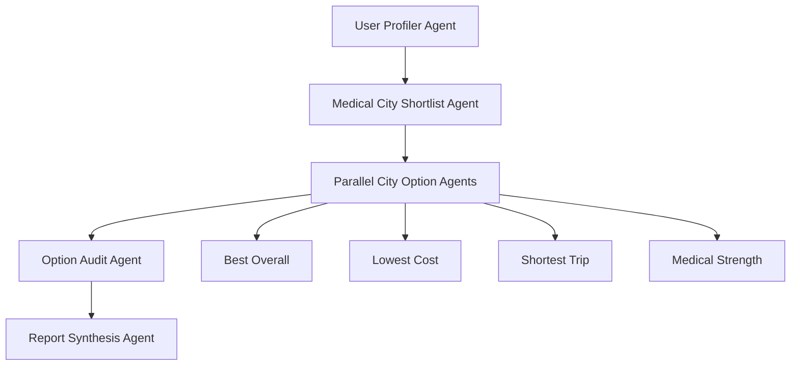

# MedTour AI Backend

This package contains the Python backend scaffold for the MedTour AI web platform.

## What Is Included

- `medtour_ai/agents/agent.py`: ADK multi-agent graph.
- `medtour_ai/agents/tools.py`: deterministic tool adapters for city, hospital, flight, hotel, cost, visa, and Alipay planning.
- `medtour_ai/agents/schemas.py`: Pydantic contracts shared by API and agents.
- `medtour_ai/services/adk_runner.py`: wrapper around ADK `Runner`.
- `medtour_ai/services/planner.py`: deterministic local planner implementation for API development and frontend integration.
- `medtour_ai/services/report_store.py`: local in-memory report store.
- `medtour_ai/api/main.py`: FastAPI routes matching `tech_design.md`.

## Agent Graph



The graph uses Google ADK workflow agents:

- `SequentialAgent` for the main deterministic pipeline.
- `ParallelAgent` for the four diversified city options.
- `LlmAgent` for specialized reasoning steps.
- `LiteLlm(model="openai/...")` so reasoning calls OpenAI through `OPENAI_API_KEY`.

The final `report_synthesis_agent` uses `REPORT_SYNTHESIS_MODEL`, defaulting to
`openai/gpt-5.1`, while earlier planning agents keep `PLANNER_MODEL`. This
spends the stronger reasoning model on the last merge, ranking, audit-summary,
and schema-shaping step.

The audit step checks whether each selected hospital source, flight estimate,
hotel estimate, medical cost, insurance data, and total-cost calculation is
reasonable enough for planning. It marks values that still need official or live
provider confirmation before non-refundable booking.

Hospital contact lookup uses the versioned skill at
`skills/lookup-china-hospital-contacts/SKILL.md`. City option agents must use
that workflow before trusting a registration email, named contact person,
appointment phone, WeChat/mini-program route, or international department
contact. The audit step treats placeholder, general, or unverified contact
routes as confirmation blockers.

Medical process timelines use the split skill at
`skills/medical-process-timeline-planner/SKILL.md`. Agents route each medical
purpose to one focused reference file:

- `references/eye-surgery.md`
- `references/tooth-implant.md`
- `references/car-t.md`
- `references/premium-medical-check.md`

City option and timeline-regeneration agents must use the selected reference
before setting checkup, treatment, recovery, post-procedure review, return
travel, urgent-sign, and ask-the-hospital constraints. The audit step flags
compressed medical timelines that do not preserve this skill reference.

## Local Setup

```bash
python3 -m venv .venv
.venv/bin/pip install -r requirements.txt
cp .env.example .env
```

Set `OPENAI_API_KEY` in `.env` before running with `planner_backend: "adk"`.
The default API path uses `planner_backend: "local"` and does not call OpenAI.

## Run The API

```bash
.venv/bin/uvicorn medtour_ai.api.main:app --reload --port 8000
```

Useful endpoints:

- `GET /api/v1/intake/schema`
- `POST /api/v1/intake/normalize`
- `POST /api/v1/reports`
- `GET /api/v1/operations/{operation_id}`
- `GET /api/v1/reports/{report_id}/status`
- `GET /api/v1/reports/{report_id}/options`
- `GET /api/v1/reports/{report_id}/options/{option_id}/timeline`
- `POST /api/v1/reports/{report_id}/options/{option_id}/timeline/regenerate`
- `PATCH /api/v1/reports/{report_id}/options/{option_id}/readiness/items/{item_id}`
- `POST /api/v1/reports/{report_id}/confirmations/{confirmation_id}/answer`
- `POST /api/v1/reports/{report_id}/advisor/handoff`

By default `POST /api/v1/reports` generates a local deterministic report
synchronously:

```json
{
  "profile_draft_id": "upd_...",
  "generation_mode": "multi_city",
  "max_city_options": 4,
  "currency": "SGD",
  "language": "en",
  "run_now": true,
  "planner_backend": "local"
}
```

Send `"run_now": false` to create a queued operation without generation.
Send `"planner_backend": "adk"` to execute the ADK multi-agent graph through
OpenAI/LiteLLM after installing dependencies and setting `OPENAI_API_KEY`.

## Run With ADK Dev UI

From the repository root:

```bash
adk web medtour_ai/agents
```

Use a JSON intake payload as the user message, for example:

```json
{
  "medical_purpose": "eye_surgery",
  "procedure_subtype": "smile_pro",
  "nationality": "SG",
  "departure_city": "Singapore",
  "date_mode": "range",
  "date_range": {"start": "2026-08-12", "end": "2026-08-18"},
  "duration_preference": "5_7_days",
  "season_flexibility": "depends_on_price",
  "budget_tier": "balanced",
  "traveler_count": 1
}
```

## Production Replacement Points

- Replace `InMemoryReportStore` with Cloud SQL / AlloyDB and Redis.
- Replace curated tool estimates with travel, hotel, FX, Google Places, visa, and RAG service adapters.
- Move background generation to Cloud Tasks or Pub/Sub instead of `run_now`.
- Replace local ADK sessions with a persistent session service or managed agent runtime.
