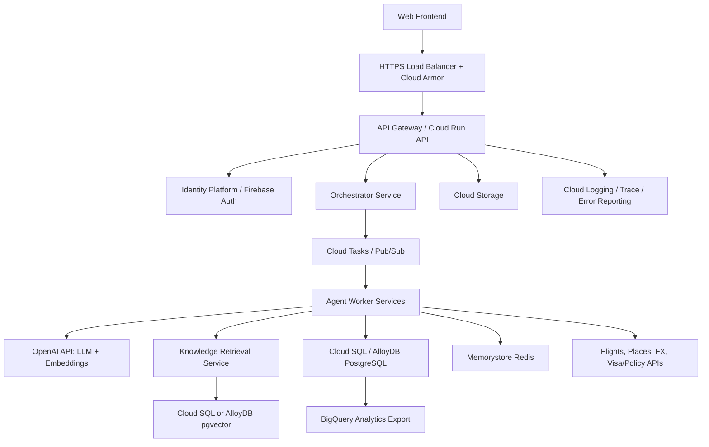
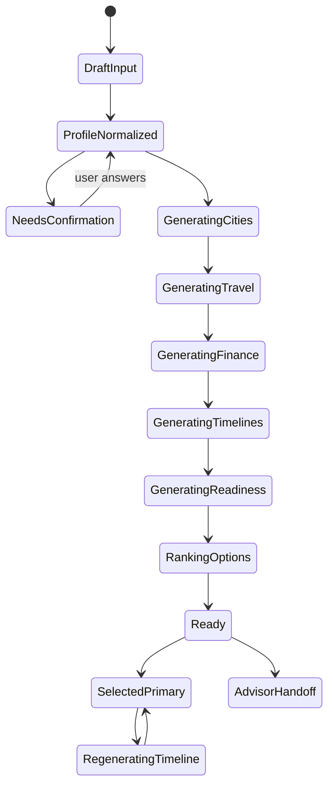
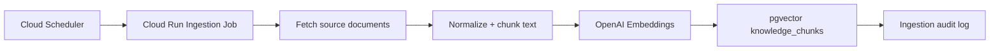

# MedTour AI Technical Design

Version: v1.0  
Date: 2026-06-29  
Related docs: `PRD.md`, `design.md`  
Product surface: Responsive web platform  

## 1. Purpose

This document describes the backend API services, Google Cloud running stack, multi-agent orchestration, data stores, and frontend integration model for MedTour AI.

MedTour AI generates medical travel plans for overseas users. The system collects guided user inputs, generates up to four China city options, estimates cost and timeline, asks for user confirmation when decisions are uncertain, and lets the frontend refine a selected plan.

## 2. Architecture Summary

MedTour AI is a web platform backed by a Google Cloud service stack and an OpenAI-powered reasoning and embedding layer.

Core principles:

- Frontend remains thin and stateful only for UI interactions.
- Backend owns report generation, agent orchestration, validation, and persistence.
- Multi-agent work is orchestrated server-side with parallel execution where possible.
- OpenAI API is used for LLM reasoning and text embeddings.
- Google Cloud hosts application services, APIs, data stores, queues, secrets, observability, and security controls.
- All medical, visa, pricing, and travel outputs are marked with source, freshness, confidence, and disclaimer status.

## 3. High-Level System Diagram



## 4. Google Cloud Running Stack

### 4.1 Runtime and Hosting

| Layer | Service | Responsibility |
| --- | --- | --- |
| Frontend hosting | Firebase Hosting or Cloud Storage + Cloud CDN | Serve static web app assets |
| Edge security | HTTPS Load Balancer, Cloud Armor | TLS, WAF, rate limiting, geo/IP controls |
| API routing | API Gateway or Cloud Run direct routing | Route `/api/*` requests to backend services |
| Backend APIs | Cloud Run | Stateless REST APIs and SSE endpoints |
| Agent workers | Cloud Run services or Cloud Run Jobs | Execute multi-agent tasks |
| Async orchestration | Cloud Tasks + Pub/Sub | Queue agent jobs, retries, fan-out/fan-in |
| Scheduled ingestion | Cloud Scheduler + Cloud Run Jobs | Refresh knowledge base, exchange rates, policy links |
| Secrets | Secret Manager | Store OpenAI key, external API keys, database credentials |
| Encryption | Cloud KMS | Customer-managed keys for sensitive data |
| Private networking | Serverless VPC Access | Private DB/cache access from Cloud Run |
| Observability | Cloud Logging, Cloud Trace, Error Reporting, Monitoring | Logs, traces, metrics, alerts |

### 4.2 Data Services

| Data type | Recommended service | Notes |
| --- | --- | --- |
| User profile, reports, city options | Cloud SQL PostgreSQL or AlloyDB | Transactional relational data |
| Vector embeddings | PostgreSQL pgvector on Cloud SQL / AlloyDB | MVP-friendly RAG store |
| Hot report status/progress | Memorystore Redis | Low-latency generation status and locks |
| Generated PDFs and exports | Cloud Storage | Signed URL downloads |
| Audit logs | Cloud Logging + BigQuery sink | Compliance and advisor activity review |
| Analytics | BigQuery | Funnel, cost, latency, model usage, conversion analysis |

### 4.3 MVP Stack Recommendation

For MVP:

- Frontend: Firebase Hosting
- API: Cloud Run `medtour-api`
- Orchestrator: Cloud Run `medtour-orchestrator`
- Agents: Cloud Run worker services behind Pub/Sub subscriptions
- Database: Cloud SQL PostgreSQL with pgvector
- Cache/status: Memorystore Redis
- Object storage: Cloud Storage
- Secrets: Secret Manager
- Observability: Cloud Logging, Trace, Error Reporting, Monitoring

This keeps operations simple while preserving a clean path to split heavy agents into separate Cloud Run services later.

### 4.4 Cloud Resource Ownership

Recommended production resource map:

| Resource | Owner service account | Access pattern |
| --- | --- | --- |
| Cloud SQL / AlloyDB | `medtour-api-sa`, `medtour-orchestrator-sa`, `medtour-agent-sa` | Private IP through Serverless VPC Access |
| Memorystore Redis | `medtour-api-sa`, `medtour-orchestrator-sa` | Private cache for report status, locks, short-lived route data |
| Cloud Storage exports bucket | `medtour-api-sa`, `medtour-pdf-exporter-sa` | Signed URLs for PDF downloads |
| Secret Manager | Per-service service account | Read only the secrets required by that service |
| Pub/Sub topics | `medtour-orchestrator-sa` publisher, `medtour-agent-sa` subscriber | Agent task fan-out and completion events |
| Cloud Tasks queues | `medtour-api-sa`, `medtour-orchestrator-sa` | Idempotent async jobs and retries |
| BigQuery analytics dataset | `medtour-analytics-writer-sa` | Append-only events and model usage summaries |

Service accounts should be separated by runtime boundary. The API service should not have broad access to model provider secrets unless it directly performs model work; model access should normally stay inside the orchestrator and agent workers.

## 5. Backend Service Boundaries

### 5.1 API Service

Cloud Run service: `medtour-api`

Responsibilities:

- Expose REST APIs to frontend.
- Validate request payloads.
- Authenticate registered users and support anonymous sessions.
- Create reports and generation operations.
- Return report, option, timeline, cost, readiness, and advisor data.
- Stream or poll generation progress.
- Enforce user authorization.
- Redact sensitive fields in logs.

### 5.2 Orchestrator Service

Cloud Run service: `medtour-orchestrator`

Responsibilities:

- Own report-generation state machine.
- Coordinate multi-agent fan-out/fan-in.
- Decide which tasks can run in parallel.
- Detect blocking confirmation requests.
- Merge agent outputs into `Report` and `CityPlanOption` records.
- Validate medical hard constraints.
- Trigger timeline regeneration for selected plan only.
- Persist generation trace and confidence metadata.

### 5.3 Agent Worker Services

Each agent can initially be implemented as a module inside one Cloud Run worker. As load grows, agents can split into separate Cloud Run services.

Agents:

- User Profiler Agent
- Medical Consultant Agent
- Travel Coordinator Agent
- Finance Estimator Agent
- Timeline Generator
- Pre-Trip Readiness Agent
- Orchestrator Agent

Recommended worker deployment:

| Worker | Agent tasks |
| --- | --- |
| `profile-agent-worker` | Guided input normalization, defaults, confirmation fields |
| `medical-agent-worker` | Medical city matching, hospital matching, medical cycle rules |
| `travel-agent-worker` | Flights, hotels, local transport, tourism |
| `finance-agent-worker` | Cost estimates, exchange rates, benchmark comparison |
| `timeline-agent-worker` | Hour-level timeline generation and regeneration |
| `readiness-agent-worker` | Visa, Alipay, documents, readiness checklist |

## 6. Multi-Agent Execution Design

### 6.1 Generation State Machine



### 6.2 Agent Execution Order

1. User Profiler Agent normalizes guided input.
2. Medical Consultant Agent generates up to four city candidates.
3. Travel Coordinator Agent generates travel plans for each city.
4. Finance Estimator Agent estimates costs for each city.
5. Timeline Generator builds timeline for each city.
6. Pre-Trip Readiness Agent builds city-specific readiness checklist.
7. Orchestrator ranks options and produces final report.

Parallelization:

- Travel and finance can run partially in parallel after medical windows exist.
- Timeline can run per city in parallel.
- Readiness can run per city after destination and stay duration are known.

### 6.3 Confirmation Requests

Any agent may emit a `ConfirmationRequest`.

Blocking confirmation examples:

- Medical project ambiguous.
- Visa/entry state uncertain.
- Flight arrival conflicts with medical appointment.
- Hotel foreign-guest eligibility unknown.
- Budget and selected service level conflict.
- User is about to select non-refundable booking while visa/appointment is unconfirmed.

Backend behavior:

- Persist confirmation request.
- Mark affected report sections as `needs_confirmation`.
- Return confirmation request to frontend.
- Suspend final plan locking if blocking.
- Regenerate only affected sections after user answers.

### 6.4 Model Calls

OpenAI API is used for:

- LLM reasoning and structured generation.
- Text embeddings for RAG chunks.

Rules:

- All model calls go through a single `ModelGateway` module.
- Model output must be JSON schema validated.
- Every call logs `trace_id`, `agent_name`, `model`, `latency_ms`, `token_usage`, `status`, and `error_code`.
- No raw passport number, card number, CVV, OTP, or payment password is sent to the model.
- Medical outputs must pass rule validation and disclaimer injection before user display.

## 7. API Design

Base path: `/api/v1`

### 7.0 Route Ownership Matrix

| Route group | Public caller | Backend owner | Async behavior |
| --- | --- | --- | --- |
| `/intake/*` | Guided planning intake page | `medtour-api` | Synchronous, with model fallback only for ambiguous normalization |
| `/reports` | Guided intake page | `medtour-api` + `medtour-orchestrator` | Creates operation and queues generation |
| `/reports/{id}/status` | Compare/generation pages | `medtour-api` | Reads Redis first, then database fallback |
| `/reports/{id}/events` | Compare/generation pages | `medtour-api` | Optional SSE stream backed by Pub/Sub or Redis status updates |
| `/reports/{id}/options/*` | Compare and plan pages | `medtour-api` | Synchronous reads and selection writes |
| `/timeline/*` | Plan detail page | `medtour-api` + `timeline-agent-worker` | Regeneration is async |
| `/costs` | Plan detail page | `medtour-api` | Synchronous read from persisted estimate |
| `/readiness/*` | Readiness checklist page | `medtour-api` + `readiness-agent-worker` | Reads are synchronous; checklist regeneration is async if inputs change |
| `/confirmations/*` | All pages | `medtour-api` + `medtour-orchestrator` | Answers may trigger partial regeneration |
| `/advisor/*` | Readiness/detail pages | `medtour-api` | Synchronous lead creation plus optional CRM webhook |

### 7.1 Session and Input APIs

#### `GET /intake/schema`

Returns guided-question configuration for the planner intake page.

Used by:

- `medtour_ai_guided_planning_intake`

Response:

```json
{
  "steps": [
    {
      "id": "medical_purpose",
      "type": "single_choice",
      "title": "What is your medical need?",
      "options": ["eye_surgery", "dental_care", "health_checkup", "medical_aesthetics"]
    }
  ],
  "defaults": {
    "budget_tier": "balanced",
    "traveler_count": 1,
    "hotel_preference": "near_hospital_foreign_guest_eligible"
  }
}
```

#### `POST /intake/normalize`

Normalizes guided answers into a `UserProfileDraft`.

Request:

```json
{
  "answers": {
    "medical_purpose": "eye_surgery",
    "procedure_subtype": "smile_pro",
    "nationality": "SG",
    "departure_city": "Singapore",
    "date_mode": "range",
    "date_range": {"start": "2026-08-12", "end": "2026-08-18"},
    "duration_preference": "5_7_days",
    "season_flexibility": "depends_on_price"
  }
}
```

Response:

```json
{
  "profile_draft_id": "upd_123",
  "field_status": {
    "medical_project": "user_confirmed",
    "budget_tier": "system_default",
    "passport_type": "needs_confirmation"
  },
  "defaults": {
    "budget_tier": "balanced",
    "travel_party_size": 1
  },
  "confirmation_requests": []
}
```

### 7.2 Report Generation APIs

#### `POST /reports`

Creates a report-generation operation.

Used by:

- Generate Options button on guided intake page

Request:

```json
{
  "profile_draft_id": "upd_123",
  "generation_mode": "multi_city",
  "max_city_options": 4,
  "currency": "SGD",
  "language": "en"
}
```

Response:

```json
{
  "report_id": "rep_123",
  "operation_id": "op_123",
  "status": "queued"
}
```

#### `GET /reports/{report_id}/status`

Returns generation progress.

Used by:

- Generation progress page

Response:

```json
{
  "report_id": "rep_123",
  "status": "generating",
  "current_stage": "building_timelines",
  "progress": 72,
  "stage_statuses": [
    {"stage": "profile", "status": "complete"},
    {"stage": "medical_city_matching", "status": "complete"},
    {"stage": "timeline_generation", "status": "running"}
  ],
  "confirmation_requests": []
}
```

Alternative:

- `GET /reports/{report_id}/events` can expose Server-Sent Events for live progress.

#### `GET /reports/{report_id}`

Returns the full report, including all city options.

Used by:

- Compare Cities page
- Plan Detail page
- Readiness Checklist page

Response shape:

```json
{
  "report_id": "rep_123",
  "profile": {},
  "city_options": [],
  "selected_option_id": "opt_shanghai",
  "confirmation_requests": [],
  "disclaimers": []
}
```

### 7.3 City Option APIs

#### `GET /reports/{report_id}/options`

Returns city option cards and comparison table fields.

Used by:

- `medtour_ai_compare_cities`

Response:

```json
{
  "options": [
    {
      "option_id": "opt_shanghai",
      "city": "Shanghai",
      "recommendation_label": "Best Overall",
      "target_hospital": "Ruijin Hospital",
      "total_estimated_cost": {"amount": 8450, "currency": "SGD"},
      "total_required_days": 7,
      "estimated_net_savings": {"amount": 3100, "currency": "SGD"},
      "medical_confidence": "high",
      "travel_confidence": "high",
      "key_risks": ["Minor language barrier outside hospital"]
    }
  ],
  "comparison": {
    "metrics": []
  }
}
```

#### `POST /reports/{report_id}/options/{option_id}/select`

Marks a city option as the primary plan.

Used by:

- Select Plan button

Response:

```json
{
  "report_id": "rep_123",
  "selected_option_id": "opt_shanghai",
  "status": "selected"
}
```

### 7.4 Timeline APIs

#### `GET /reports/{report_id}/options/{option_id}/timeline`

Returns detailed timeline nodes.

Used by:

- `medtour_ai_your_plan_detail`

Response:

```json
{
  "option_id": "opt_shanghai",
  "timeline_version_id": "tlv_1",
  "days": [
    {
      "day": 1,
      "date": "2026-08-12",
      "title": "Arrival & Check-in",
      "items": [
        {
          "item_id": "tli_1",
          "category": "flight",
          "start_time": "2026-08-12T08:00:00+08:00",
          "end_time": "2026-08-12T14:30:00+08:00",
          "title": "Flight SQ830 Arrival",
          "location_name": "Pudong International Airport",
          "address": "PVG Terminal 2",
          "estimated_cost": {"amount": 450, "currency": "SGD"},
          "confidence_level": "high",
          "flight_details": {
            "airline": "Singapore Airlines",
            "flight_number": "SQ830",
            "departure_airport": "SIN",
            "arrival_airport": "PVG",
            "arrival_terminal": "T2"
          }
        }
      ]
    }
  ]
}
```

#### `POST /reports/{report_id}/options/{option_id}/timeline/regenerate`

Regenerates timeline after preference edits.

Used by:

- Edit Timeline / Regenerate Timeline flow

Request:

```json
{
  "base_timeline_version_id": "tlv_1",
  "preferences": {
    "stay_length_preference": "5_7_days",
    "flight_preference": "avoid_red_eye",
    "hotel_budget_tier": "balanced",
    "tourism_intensity": "light"
  }
}
```

Response:

```json
{
  "operation_id": "op_regen_123",
  "status": "queued"
}
```

#### `POST /reports/{report_id}/options/{option_id}/timeline/{timeline_version_id}/accept`

Accepts a regenerated timeline version.

### 7.5 Cost APIs

#### `GET /reports/{report_id}/options/{option_id}/costs`

Returns cost dashboard and itemized cost rows.

Used by:

- Cost sidebar on Plan Detail page
- Cost Dashboard page

Response:

```json
{
  "currency": "SGD",
  "exchange_rate": {
    "from": "RMB",
    "to": "SGD",
    "rate": 0.185,
    "updated_at": "2026-06-29T08:00:00Z"
  },
  "total": {"amount": 8450, "currency": "SGD"},
  "categories": [
    {"category": "medical", "amount": 6200, "confidence": "medium"},
    {"category": "hotel", "amount": 1540, "confidence": "high"},
    {"category": "travel", "amount": 710, "confidence": "high"}
  ],
  "benchmark": {
    "home_country_price": 11550,
    "net_savings": 3100
  }
}
```

### 7.6 Readiness APIs

#### `GET /reports/{report_id}/options/{option_id}/readiness`

Returns readiness checklist.

Used by:

- `medtour_ai_readiness_checklist`

Response:

```json
{
  "completion_percent": 65,
  "completed_count": 11,
  "total_count": 17,
  "high_risk_items": [
    {
      "id": "visa_status",
      "title": "Visa status not confirmed",
      "deadline": "2026-07-15",
      "priority": "high"
    }
  ],
  "sections": [
    {
      "title": "Visa & Entry",
      "items": []
    }
  ]
}
```

#### `PATCH /reports/{report_id}/options/{option_id}/readiness/items/{item_id}`

Updates readiness item status.

Request:

```json
{
  "status": "complete",
  "note": "Alipay installed and linked to card"
}
```

### 7.7 Confirmation APIs

#### `GET /reports/{report_id}/confirmations`

Returns pending confirmation questions.

#### `POST /reports/{report_id}/confirmations/{confirmation_id}/answer`

Submits user answer.

Request:

```json
{
  "selected_option": "balanced",
  "freeform_note": null
}
```

Response:

```json
{
  "status": "accepted",
  "affected_sections": ["city_ranking", "timeline", "costs"],
  "regeneration_required": true,
  "operation_id": "op_confirm_123"
}
```

### 7.8 Advisor APIs

#### `POST /reports/{report_id}/advisor/handoff`

Creates advisor lead after user consent.

Request:

```json
{
  "selected_option_id": "opt_shanghai",
  "contact": {
    "name": "Sun",
    "email": "sun@example.com",
    "phone": "+65..."
  },
  "preferred_language": "en",
  "consent": true
}
```

Response:

```json
{
  "lead_id": "lead_123",
  "status": "new"
}
```

## 8. Frontend Page Integration

### 8.1 `medtour_ai_guided_planning_intake`

Backend interactions:

1. `GET /api/v1/intake/schema`
2. User answers guided questions locally.
3. `POST /api/v1/intake/normalize`
4. Display defaults and confirmation fields.
5. `POST /api/v1/reports`
6. Navigate to generation progress / compare view.

Frontend state:

- `answers`
- `profile_draft_id`
- `field_status`
- `defaults`
- `confirmation_requests`

### 8.2 `medtour_ai_compare_cities`

Backend interactions:

1. Poll `GET /api/v1/reports/{report_id}/status` until ready.
2. `GET /api/v1/reports/{report_id}/options`
3. Render city cards and side-by-side analysis.
4. On Select Plan: `POST /api/v1/reports/{report_id}/options/{option_id}/select`
5. Navigate to selected plan detail.

Frontend state:

- `report_id`
- `city_options`
- `selected_option_id`
- `sort_mode`
- `comparison_visibility`

### 8.3 `medtour_ai_your_plan_detail`

Backend interactions:

1. `GET /api/v1/reports/{report_id}/options/{option_id}/timeline`
2. `GET /api/v1/reports/{report_id}/options/{option_id}/costs`
3. If user edits preferences: `POST /timeline/regenerate`
4. Poll operation status.
5. Accept version: `POST /timeline/{timeline_version_id}/accept`

Frontend state:

- `timeline_version_id`
- `timeline_days`
- `cost_dashboard`
- `timeline_preferences`
- `regeneration_diff`

### 8.4 `medtour_ai_readiness_checklist`

Backend interactions:

1. `GET /api/v1/reports/{report_id}/options/{option_id}/readiness`
2. User checks tasks.
3. `PATCH /readiness/items/{item_id}`
4. If advisor confirmation needed: `POST /advisor/handoff`

Frontend state:

- `completion_percent`
- `high_risk_items`
- `checklist_sections`
- `item_status_updates`

### 8.5 Frontend State and Navigation Contract

The current static web implementation uses hash routes:

- `#intake`
- `#compare`
- `#plan`
- `#readiness`

Production can keep the same logical page model even if routes become full URLs:

| Current mock route | Production route | Required query/state |
| --- | --- | --- |
| `#intake` | `/plan/start` | Optional `session_id` |
| `#compare` | `/reports/{report_id}/compare` | `report_id` |
| `#plan` | `/reports/{report_id}/options/{option_id}/timeline` | `report_id`, `option_id`, `timeline_version_id` |
| `#readiness` | `/reports/{report_id}/options/{option_id}/readiness` | `report_id`, `option_id` |

Frontend-owned state:

- Current form step and optimistic UI selections.
- Local display preferences such as selected currency and language.
- Expanded/collapsed timeline sections.
- Pending, unsaved timeline preference edits.

Backend-owned state:

- Normalized user profile.
- Report generation status.
- City option ranking and selected option.
- Timeline versions and accepted timeline.
- Cost estimates and source metadata.
- Confirmation requests and answers.
- Readiness checklist status.

The frontend should treat generated plans as versioned server data. When the user changes preferences, the frontend sends a regeneration request and renders the returned version only after the backend marks it `ready`. Previous accepted versions should remain visible until the user explicitly accepts the regenerated version.

## 9. Data Model

### 9.1 Core Tables

```sql
users (
  id uuid primary key,
  auth_provider_id text,
  email text,
  country text,
  created_at timestamptz
)

anonymous_sessions (
  id uuid primary key,
  session_token_hash text,
  expires_at timestamptz,
  created_at timestamptz
)

user_profile_drafts (
  id uuid primary key,
  user_id uuid null,
  session_id uuid null,
  answers jsonb,
  normalized_profile jsonb,
  field_status jsonb,
  defaults jsonb,
  created_at timestamptz,
  updated_at timestamptz
)

reports (
  id uuid primary key,
  user_id uuid null,
  session_id uuid null,
  profile_draft_id uuid,
  status text,
  selected_option_id uuid null,
  language text,
  currency text,
  created_at timestamptz,
  updated_at timestamptz
)

city_plan_options (
  id uuid primary key,
  report_id uuid references reports(id),
  city text,
  recommendation_label text,
  recommendation_rank int,
  recommendation_reason text,
  target_hospital text,
  medical_plan jsonb,
  travel_plan jsonb,
  financial_estimate jsonb,
  pre_travel_checklist jsonb,
  total_required_days int,
  total_estimated_cost numeric,
  estimated_net_savings numeric,
  confidence jsonb,
  key_risks jsonb,
  selected_as_primary boolean default false,
  created_at timestamptz
)

timeline_versions (
  id uuid primary key,
  option_id uuid references city_plan_options(id),
  version_number int,
  status text,
  preferences jsonb,
  diff_summary jsonb,
  accepted_by_user boolean default false,
  created_at timestamptz
)

timeline_items (
  id uuid primary key,
  timeline_version_id uuid references timeline_versions(id),
  day int,
  start_time timestamptz,
  end_time timestamptz,
  category text,
  title text,
  location_name text,
  address text,
  cost jsonb,
  details jsonb,
  hard_constraint boolean,
  confidence_level text
)
```

### 9.2 Agent and RAG Tables

```sql
agent_runs (
  id uuid primary key,
  report_id uuid,
  option_id uuid null,
  agent_name text,
  status text,
  input_hash text,
  output jsonb,
  error jsonb,
  started_at timestamptz,
  completed_at timestamptz
)

model_calls (
  id uuid primary key,
  trace_id text,
  agent_run_id uuid,
  provider text,
  model text,
  purpose text,
  latency_ms int,
  input_tokens int,
  output_tokens int,
  status text,
  created_at timestamptz
)

knowledge_documents (
  id uuid primary key,
  source_type text,
  source_url text,
  title text,
  country text,
  city text,
  medical_project text,
  source_updated_at timestamptz,
  ingested_at timestamptz
)

knowledge_chunks (
  id uuid primary key,
  document_id uuid references knowledge_documents(id),
  chunk_text text,
  embedding vector,
  embedding_model text,
  embedding_version text,
  metadata jsonb
)

confirmation_requests (
  id uuid primary key,
  report_id uuid,
  option_id uuid null,
  agent_name text,
  question text,
  reason text,
  blocking boolean,
  options jsonb,
  selected_option text null,
  status text,
  affected_sections jsonb,
  created_at timestamptz,
  answered_at timestamptz null
)
```

## 10. RAG and Knowledge Ingestion

### 10.1 Sources

Knowledge sources:

- Hospital international department information.
- Medical project rules.
- Estimated medical price ranges.
- Visa and entry policy links.
- Payment setup official guides.
- Hotel foreign-guest eligibility notes.
- Home-country benchmark prices.

### 10.2 Ingestion Pipeline



Rules:

- Every chunk stores source URL, source update time, ingestion time, model name, and chunk ID.
- Outdated or low-confidence chunks cannot support definitive claims.
- Visa and medical policy outputs must include source freshness.

## 11. Security and Privacy

### 11.1 Authentication

Supported modes:

- Anonymous session for first report.
- Registered user via Identity Platform / Firebase Auth.
- Advisor and operations roles via Identity Platform with role claims.

### 11.2 Authorization

Authorization rules:

- Users can read their own reports.
- Anonymous sessions can read only reports created under the same signed session.
- Advisors can read reports only after explicit user handoff consent.
- Operations users cannot view user contact details unless granted compliance/admin role.

### 11.3 Sensitive Data Handling

Rules:

- Do not store full payment card data, CVV, OTP, or payment password.
- Do not send strong identifiers to OpenAI unless explicitly necessary and authorized.
- Store sensitive fields encrypted at rest.
- Redact logs by default.
- Use Cloud KMS for encryption keys.
- Use Secret Manager for OpenAI and third-party API keys.

### 11.4 Network Security

Controls:

- HTTPS only.
- Cloud Armor WAF and rate limiting.
- Private database access through Serverless VPC Access.
- Least-privilege service accounts.
- VPC Service Controls for sensitive data perimeter where required.

## 12. Reliability and Performance

### 12.1 Performance Targets

- First page load interactive: ≤ 3 seconds.
- Report generation P95: ≤ 15 seconds for MVP target.
- Intake normalize API: ≤ 500 ms P95 excluding model fallback.
- Report status API: ≤ 200 ms P95.
- Timeline regeneration P95: ≤ 15 seconds.

### 12.2 Resilience

Patterns:

- Cloud Tasks retries with exponential backoff.
- Idempotency keys for report generation and timeline regeneration.
- Partial fallback to estimated data when external travel APIs fail.
- Circuit breakers around slow or failing external APIs.
- Persist last successful report version.
- Mark degraded data clearly in API response.

### 12.3 Caching

Cache candidates:

- Exchange rates.
- Hotel search result summaries.
- Flight estimates by route/date bucket.
- Visa policy lookups.
- Knowledge retrieval results by query hash.

Use Redis TTLs:

- Exchange rates: 1 hour.
- Flight estimates: 15-60 minutes.
- Hotel estimates: 1-6 hours.
- Visa/policy links: 24 hours plus source freshness.

## 13. Observability

### 13.1 Trace IDs

Every request and agent run carries:

- `trace_id`
- `report_id`
- `operation_id`
- `agent_run_id`

### 13.2 Metrics

Required metrics:

- API latency by route.
- Report generation latency.
- Agent latency and error rate.
- OpenAI token usage and cost.
- External API latency and error rate.
- Low-confidence output rate.
- Confirmation request rate.
- Timeline regeneration success rate.
- Advisor handoff conversion.

### 13.3 Logs

Log fields:

- `severity`
- `trace_id`
- `user_id_hash` or `session_id_hash`
- `report_id`
- `operation_id`
- `agent_name`
- `status`
- `error_code`
- `latency_ms`

Do not log:

- Full medical free text.
- Passport number.
- Contact details.
- Payment details.
- Model prompts containing sensitive fields.

## 14. Deployment Design

### 14.1 Environments

| Environment | Purpose |
| --- | --- |
| `dev` | Local and sandbox testing |
| `staging` | Integration testing with test API keys |
| `prod` | Production traffic |

### 14.2 CI/CD

Recommended pipeline:

1. Run lint, type checks, unit tests.
2. Build frontend.
3. Build backend container images.
4. Run contract tests for API schemas.
5. Deploy to staging Cloud Run.
6. Run smoke tests.
7. Promote to prod with manual approval.

### 14.3 Cloud Run Services

Initial Cloud Run services:

- `medtour-api`
- `medtour-orchestrator`
- `medtour-agent-worker`
- `medtour-ingestion-job`
- `medtour-pdf-exporter`

Split later if needed:

- `medical-agent-worker`
- `travel-agent-worker`
- `finance-agent-worker`
- `timeline-agent-worker`
- `readiness-agent-worker`

## 15. Frontend-Backend Contract Rules

### 15.1 Response Metadata

Every generated section should include:

```json
{
  "source": "rag|external_api|agent_estimate|advisor_confirmed",
  "source_updated_at": "2026-06-29T00:00:00Z",
  "generated_at": "2026-06-29T08:00:00Z",
  "confidence_level": "high|medium|low",
  "data_status": "real_time|estimated|stale|needs_confirmation"
}
```

### 15.2 Error Contract

```json
{
  "error": {
    "code": "EXTERNAL_FLIGHT_API_UNAVAILABLE",
    "message": "Live flight data is unavailable. The report can continue with estimates.",
    "recoverable": true,
    "next_actions": ["continue_with_estimates", "retry", "contact_advisor"]
  }
}
```

### 15.3 Confirmation Contract

```json
{
  "confirmation_id": "conf_123",
  "blocking": true,
  "question": "Choose planning priority",
  "reason": "Shanghai and Guangzhou both work, but cost and travel time differ.",
  "recommended_option": "best_overall",
  "options": [
    {
      "id": "best_overall",
      "label": "Best overall",
      "impact": "Balanced medical strength, flight convenience, and total cost."
    }
  ]
}
```

## 16. Implementation Phases

### Phase 1: Static UI and API Contracts

- Implement frontend pages from Stitch mocks.
- Define TypeScript API schemas.
- Build mock API server.
- Wire guided intake, city comparison, timeline, costs, readiness.

### Phase 2: Backend MVP

- Cloud Run API service.
- PostgreSQL schema.
- Report generation orchestration.
- OpenAI ModelGateway.
- Basic RAG over manually curated hospital/project rules.
- Multi-city city option generation.

### Phase 3: Dynamic Integrations

- Flight and hotel APIs.
- Google Places API.
- Exchange rate API.
- Visa/policy ingestion.
- PDF export.

### Phase 4: Advisor and Ops

- Advisor lead workspace.
- Knowledge base operations UI.
- Audit logs.
- Manual confirmation workflow.

## 17. Open Questions

- Should MVP use Cloud SQL PostgreSQL with pgvector or AlloyDB from day one?
- Should report generation use polling only, or Server-Sent Events for progress?
- Which flight and hotel data providers are available commercially?
- Should advisor handoff connect to an existing CRM?
- Which countries are legally approved for launch beyond Singapore, Malaysia, and the United States?
- What is the retention policy for anonymous reports?
